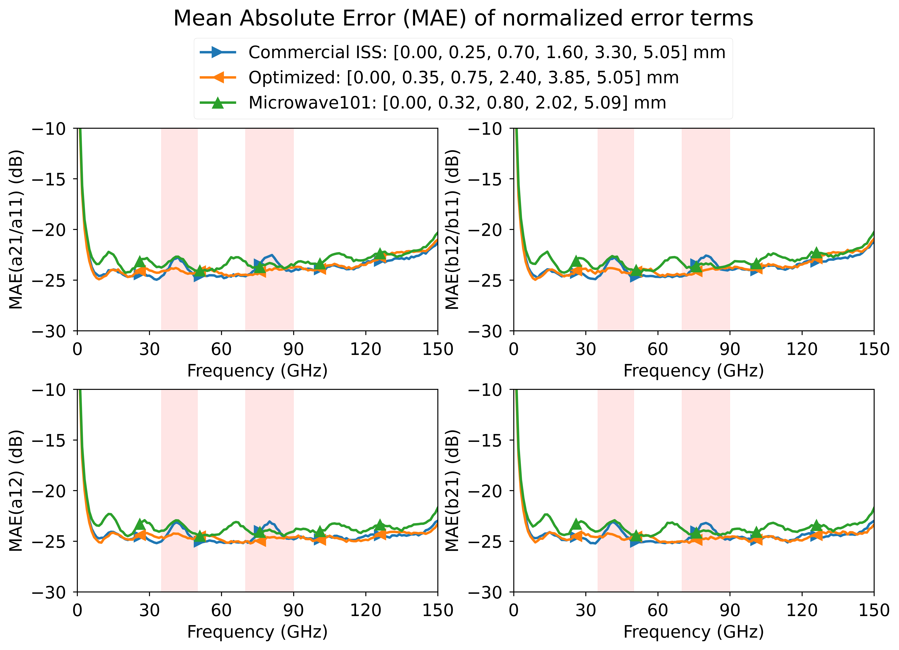

# Calculate Line Lengths for Multiline TRL Calibration

This repository contains code to calculate the line lengths for multiline TRL calibration. The procedure allows you to determine the line lengths using three methods:
- Brute-force global constrained optimization
- Wichmann sparse ruler method
- Golomb sparse ruler method

This procedure is specifically designed to provide robust line lengths for the multiline TRL algorithm described in [1,2]. Also, refer to <https://github.com/ZiadHatab/multiline-trl-calibration>.

**Basic Features:**
- Compute the minimum required number of lines and their lengths based on frequency requirements.
- Calculate the maximum allowable line length from the minimum frequency.
- Enforce a minimum spacing constraint between line lengths.
- Minimize sensitivity to length errors (specified as standard deviation).
- Support complex-valued, frequency-dependent effective relative permittivity (i.e., lossy lines).
- Provide predefined solutions without optimization using Wichmann and Golomb sparse rulers (I strongly recommend Golomb rulers!).

> **Note:** Line lengths are specified relative to the "thru," which is set to zero by default. Therefore, the first line always has a length of zero.

## Code requirements

You need to have [`numpy`][numpy] and [`scipy`][scipy] installed in your Python environment. To install these packages, run the following command:

```powershell
python -m pip install numpy scipy -U
```

For plotting, you also need [`matplotlib`][matplotlib].

## How to Use

Below is an example demonstrating how to compute the line lengths. You only need to use one of the available methods. The Golomb and Wichmann methods are non-iterative and provide immediate results, while the optimization procedure may take a few seconds to several minutes to complete.

```python
import numpy as np
# my code
from lengthcalc import LineLengthCalculator

if __name__ == "__main__":
    fmin = 2e9
    fmax = 150e9
    freq = [fmin, fmax]
    ereff = 5.2
    phi  = 30        # phase margin in degs

    # optional parameters to further constrain the solution
    lmax = 5050e-6      # bound max length (overwrite calculated value from fmin)
    length_std = 50e-6  # expected standard deviation in lengths
    lmin = 50e-6        # minimum length spacing
    force_integer_multiple = True  # quantize the lengths to multiple of lmin > 0
    # N = 6             # force the number of lines (for optimizer solution)

    # Instantiate the calculator
    calc = LineLengthCalculator(freq, ereff, phi, lmax=lmax, lmin=lmin,
                                length_std=length_std, 
                                force_integer_multiple=force_integer_multiple, 
                                polish=True, opt_max_iter=1000)
    # Calculate lengths
    lengths_optimzed = calc.calc_lengths_optimize()
    lengths_wichmann = calc.calc_length_wichmann()
    lengths_golomb = calc.calc_length_golomb()
```

## Examples

The provided examples demonstrate various use cases, including dispersive and lossy transmission lines with frequency-dependent characteristics, as well as line length calculations for waveguide applications. Each example file contains detailed comments explaining different scenarios. Note that the optimization process duration varies from several minutes to longer, depending on the problem complexity and chosen constraints.

The primary objective in finding optimal lengths is to minimize and distribute uncertainty across frequencies when measurement perturbations occur. In [example-3.py](https://github.com/ZiadHatab/line-length-multiline-trl-calibration/blob/main/example-3.py), a Monte Carlo analysis (5000 trials) demonstrates that optimized lengths perform better across frequencies compared to state-of-the-art commercial ISS lengths. This improvement is illustrated in the plot below, showing the mean absolute error of normalized error terms. Notice how the higher error peaks from commercial ISS lengths correlate with the dips in the normalized eigenvalue shown in the subsequent plot.


_MAE of normalized error terms._


_Normalized eigenvalue._

> **Notes:**
>
> - Some of the example files require additional libraries. Please check the header for exact required libraries.
>
> - Transmission line models were taken from here: <https://github.com/ZiadHatab/transmission-line-models>

## References

[1] Z. Hatab, M. Gadringer and W. Bösch, "Improving The Reliability of The Multiline TRL Calibration Algorithm," 2022 98th ARFTG Microwave Measurement Conference (ARFTG), 2022, pp. 1-5, [doi:10.1109/ARFTG52954.2022.9844064](https://doi.org/10.1109/ARFTG52954.2022.9844064).

[2] Z. Hatab, M. E. Gadringer, and W. Bösch, "Propagation of Linear Uncertainties through Multiline Thru-Reflect-Line Calibration," in IEEE Transactions on Instrumentation and Measurement, vol. 72, pp. 1-9, 2023, [doi:10.1109/TIM.2023.3296123](https://doi.org/10.1109/TIM.2023.3296123).

## License

[](https://choosealicense.com/licenses/bsd-3-clause/)


[numpy]: https://github.com/numpy/numpy
[skrf]: https://github.com/scikit-rf/scikit-rf
[scipy]: https://github.com/scipy/scipy
[matplotlib]: https://github.com/matplotlib/matplotlib